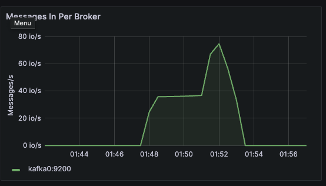
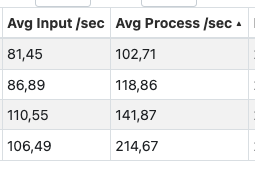
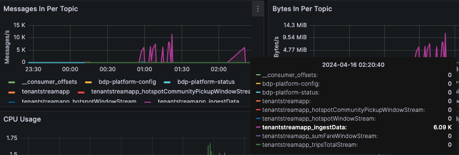
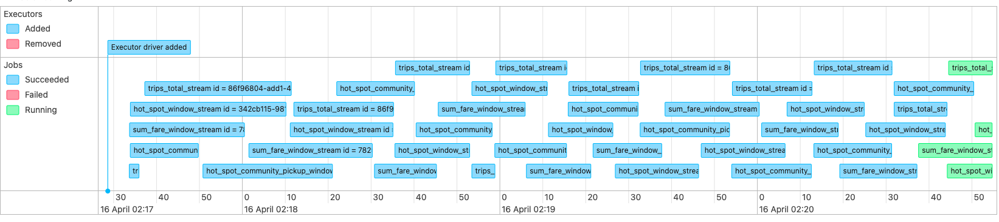
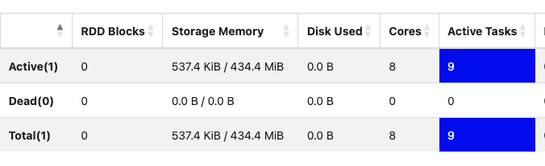
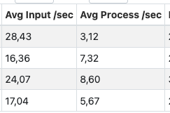
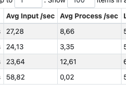
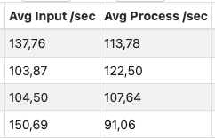
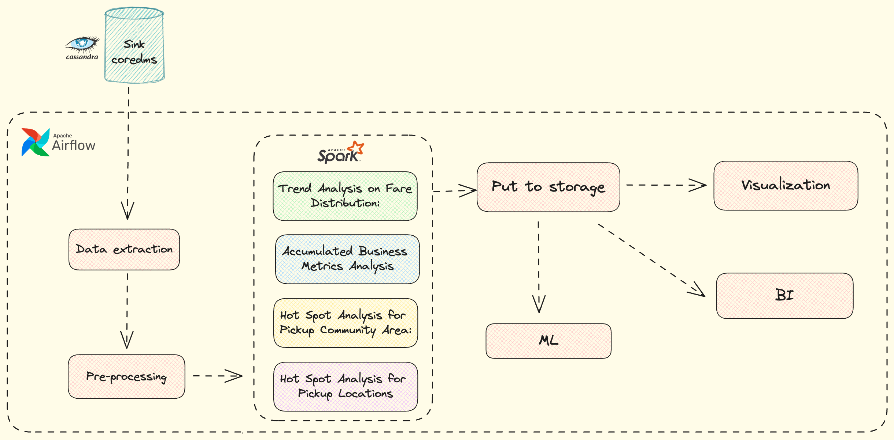

# Part 1 - Design for streaming analytics

## 1. Dataset
As a tenant, we will choose the dataset of [Taxi Trips by City of Chicago (2013-2023)](https://data.cityofchicago.org/Transportation/Taxi-Trips-2013-2023-/wrvz-psew/about_data) as a running scenario. This dataset contains information about taxi trip records from 2013 to 2023 reported to the City of Chicago.
With 23 attributes for each data point, including trip duration, distance, location of pickup and dropoff, fares, etc, streaming analytics can provide valuable insights for operations, customer preference that ultimately contribute to the decision making process, improving overall service quality. 

| Trip ID                        | Taxi ID                                                                                        | Trip Start Timestamp   | Trip End Timestamp     | Trip Seconds | Trip Miles | Pickup Census Tract | Dropoff Census Tract | Pickup Community Area | Dropoff Community Area | Fare  | Tips | Tolls | Extras | Trip Total | Payment Type | Company      | Pickup Centroid Latitude | Pickup Centroid Longitude | Pickup Centroid Location            | Dropoff Centroid Latitude | Dropoff Centroid Longitude | Dropoff Centroid Location           |
|--------------------------------|------------------------------------------------------------------------------------------------|------------------------|------------------------|--------------|------------|---------------------|----------------------|-----------------------|------------------------|-------|------|-------|--------|------------|--------------|--------------|--------------------------|---------------------------|------------------------------------|---------------------------|----------------------------|------------------------------------|
| 0002044d | 476c001 | 01/22/2024 01:45:00 PM | 01/22/2024 02:00:00 PM | 841          | 2.2        |                     |                      | 8                     | 28                     | 10.25 | 4.00 | 0.00  | 1.00   | 15.75      | Credit Card  | City Service | 41.899602111             | -87.633308037             | POINT (-87.6333080367 41.899602111) | 41.874005383              | -87.66351755              | POINT (-87.6635175498 41.874005383) |

Some of the valuable insights can be analyzed from this dataset include:

### Streaming Analytics 
- Total metrics in a window: calculating the total of several metrics (fare, tips, trips total) for a window of time (daily), operators can see the peak hours when demand is high, base on that adjust fleet availability and pricing strategy.
- Accumulated business metrics so far in a day: calculating accumulated number of trip, fare and average tips, total so far in a day, providing a real-time view of daily business performance.
- Hot spot for pickup community area: Chicago has 77 communities area, and the information about pickup community area are also provided. This can be used to identify popular areas for pickup, useful for resource allocation.
- Hot spot for pickup location: using geo-location, we can specify popular places for pickup, increase dispatch efficiency.

### Batch Analytics 
- Trends and patterns in fare distribution: based on historical analyzed result on daily fare distribution, company can analyze the overal trends and patterns over different time windows (monthly, quarterly, annualy), and further optimize service performance/quality.
- Accumulated business metrics: aggregating daily metrics on trip, fare, tips to calculate the accumulated revenue in a wider time window (monthly, annualy). This information can be used to make strategic decisions and adjust operational strategies.
- Hot spot for pickup community area: based on historical data on popular community area, operator can identify persistent hot spots, and further analyze factors contributing to their popularity (proximity to attraction, population, etc).
- Hot spot for pickup location: the aggregated historical data can give more accurate data on frequency of pick-ups at each location, combine with study on factors contributing to their popularity to optimize dispatching algorithms, route planning, and resource allocation for drivers.


## 2. Data Constrains
### Keyed or Non-keyed Data Streams 
For our tenant usecase, since the analytic data does not rely on operations that require grouping, aggregating or processing based on any specific attributes, we treat all events EQUALLY. Hence, our streaming analytics platform only deals with **Non-keyed Data Streams**. 


### Message Delivery Guarantees
**Expected throughput**: Base on [previous analysis](https://toddwschneider.com/posts/chicago-taxi-data/) conducted, the number of taxi trips per day in Chicago averages around 50k to 100k during normal day and peaked at 150k on holiday occasions like St. Patrick's Day Parade. With our sample dataset, there are around 55k taxi trip records per day. *With the amount of events, we expected this fall into the comfort zone of our messaging system levering Kafka.*

**The importance of a single message**: One taxi record is packed with useful informatin that directly contributes to the company's decision at the time on pricing, resource allocation and optimization. However, consider these data are used for analytical purpose, and the high volume of taxi trips per day, an appropriate semantic guarantee should prioritize *durability* and *availability*.

With these considerations on tenant data, our messaging system should support the Message Delivery Guarantees level of [**At least once**](https://docs.confluent.io/kafka/design/delivery-semantics.html) which already comes as default. With this, each message is guaranteed delivered at least one time. Messages are never lost, but they may be delivered more than once.

## 3. Time, Windows, Out-of-order, and Watermarks
### Event Time
In order to produce useful insights as the tenant has defined, and guarantee the **real-time** characteristic associated with the real world, it is mandatory that our data sources come with **Event Time** for each record. This refers to the time when a taxi trip actually occurred in the real world. Fortunately, the tenant's dataset has already come with 2 timestamp attribute of *Trip Start Timestamp* and *Trip End Timestamp*.

### Windows
Different operations will handle different types of window on analytic data. 
1. **Total metrics in a window**: as this operation aims to calculate fare distribution in a fixed non-overlap period of time, a tumbling window of `5 seconds` base on `event_timestamp` is used.
2. **Accumulated business metrics so far in a day**: No window needed as this operation aims to provide a real-time view into business performance, new results will be added to previous one, thus the task will run as soon as possible.
3. **Hot spot for pickup community area**: the operation calculate the occurrence of community areas for the past period of time (1 minute), thus using a *sliding* window of `1 minute` for every `30 seconds` base on `event_timestamp`.
4. **Hot spot for pickup location**: same as the above, this operation calculate the occurrence of popular pickup locations for the past period of time (1 minute), thus using a *sliding* window of `1 minute` for every `30 seconds` base on `event_timestamp`.

### Out-of-order data
Several reasons that can cause out-of-order data include:
1. Network delay/latency: our whole platform is designed with distribute components, thus relies on network to communicate. Any network delay can cause data to arrived out-of-order. This can happen at all stages of the pipeline (data source publish/consume, data sink publish/consume).
2. Processing delay: depend on the factor of parallelism and resources allocated to Kafka (partitions) and Spark (maximum tasks) that one slow task can cause out-of-order for subsequent records.
3. Out-of-order source: even though in our example, emulated data is guaranteed having ordered event time assigned for each record, in real life scenario, data can be out-of-order from the source.

### Watermarks
Since several of our operations relies on aggregating data for a specify time window, it's mandatory for Spark application to enforce watermarking to address the issue of out-of-order data and ensure correct results for window-based operations.

## 4. Performance metrics
Important performance metrics that our tenant need to be aware include metrics collected from the platform' message brokers (Kafka) and the streaming analytic engine (Sparl). 

Each component will have different ways and metrics to measure throughput. Here are some of the important metrics (non-exhaustive list) and how our platform helps tenant in measuring it.

### Data Throughput
#### Definition
Measure the rate of data being processed by our platform. 
Each component will have different ways and metrics to measure throughput. Here are some of the indicators in our platform and how we collect these metrics:

#### Kafka
> All Kafka related metrics will be generated by [JMX](https://docs.sysdig.com/en/docs/sysdig-monitor/using-monitor/metrics/metrics-library/sysdig-legacy-format/applications/apache-kafka-metrics/apache-kafka-jmx-metrics/) plugin installed in our cluster, then exported using [jmx_exporter](https://github.com/prometheus/jmx_exporter) library that also map to Prometheus format. A Prometheus instance will scrape these metrics and 
expose via REST API. 

| Components | Metrics | JMX Mapping | Purpose |
|-----------------|-----------------|-----------------|-----------------|
| Kafka    | Message In Per Broker    | kafka_server_brokertopicmetrics_messagesin_total    | Understanding the workload distribution across brokers and can be useful for capacity planning and load balancing.   |
| Kafka   | Message In Per Topic    | kafka_server_brokertopicmetrics_messagesin_total    | Insights into the workload distribution across topics and can help identify hotspots or heavily utilized topics.   |
| Kafka   | Bytes In/Out Per Broker    | kafka_server_brokertopicmetrics_bytesout_total / kafka_server_brokertopicmetrics_bytesin_total    | Understanding the network traffic and resource utilization of each broker, plan for optimization, diagnosing performance issues. |
| Kafka   | Bytes In/Out Per Topic   | kafka_server_brokertopicmetrics_bytesin_total / kafka_server_brokertopicmetrics_bytesout_total    | Identifying topics with high data throughput, and optimizing storage and replication configurations.   |


**All metrics will be visualized via Grafana dashboard.**


#### Spark
> Apache Spark provides a suite of web UI out of the box that our tenant/operator can use to monitor the status and resource consumption of Spark cluster.

| Components | Metrics  | Purpose |
|-----------------|-----------------|-----------------|
| Spark    | Input Rate (/sec)      | Measure data read from input sources helps in understanding the data ingestion throughput, useful for optimizing data ingestion strategies.    |
| Spark   | Process Rate (/sec)     | Measure the rate Spark application processes incoming data. This helps in assessing the performance of data processing logic and identifying potential bottlenecks or areas for optimization  |
| Spark   | Input Rows (records)     | Measure total number of input records or rows processed helps in understanding the volume of data processed, useful for optimizing performance and resource utilization   |


**Overview throughput** <br>


### Resource Utilization

#### Kafka
| Components | Metrics | JMX Mapping | Purpose |
|-----------------|-----------------|-----------------|-----------------|
| Kafka    | Kafka log size by broker    | kafka_log_log_size    | Monitoring log size by broker helps in understanding the storage utilization of individual brokers. This helps in  disk space management, identifying potential issues such as disk space shortages.   |
| Kafka   | Kafka log size by topic    | kafka_log_log_size    | Monitoring log size on a per-topic basis provides insights into the storage utilization of each topic in the Kafka cluster. This helps in identifying topics with large data volumes, potential retention policy violations, etc.   |
| Kafka   | CPU Usage   | process_cpu_seconds_total    | Understanding the computational workload and resource utilization of Kafka components (bottlenecks, inefficient configurations, increased message throughput) |
| Kafka   | JVM Memory Usage   | jvm_memory_bytes_used   | Detecting memory leaks, optimizing memory settings as memory-related issues can impact Kafka's reliability and availability.  |


#### Spark

| Components | Metrics  | Purpose |
|-----------------|-----------------|-----------------|
| Spark    | Batch Duration      | Measure duration of each batch helps in identifying potential latency of data processing, identifying performance bottlenecks, etc   |
| Spark   | Operation Duration     | Monitoring operation duration helps in identifying slow or inefficient operations within the job, optimizing code and algorithms for better performance |
| Spark   | Aggregated State Memory Used In Bytes     | Understanding how much memory the intermediate state required for a particular batch, useful for optimizing memory resourece.  |

**Detail query statistic** <BR>


### Service Health & Fault tolerance

#### Kafka
| Components | Metrics | JMX Mapping | Purpose |
|-----------------|-----------------|-----------------|-----------------|
| Kafka    | Brokers Online    | kafka_server_replicamanager_leadercount    | Make sure the cluster has the expected number of active brokers and detects any unexpected broker failures.   |
| Kafka   | Active Controllers   | kafka_controller_kafkacontroller_activecontrollercount    | Make sure there is always an active controller is crucial for the cluster's stability and availability  |
| Kafka   | Online Partitions  | kafka_server_replicamanager_partitioncount    | Monitoring online partitions helps detect any issues with partition availability |
| Kafka   | Record error rate   | record-error-rate   | Errors can include issues like serialization errors, network timeouts, or broker unavailability. This metric helps identify issues that may affect the reliability and consistency of data processing  |

#### Spark

| Components | Metrics  | Purpose |
|-----------------|-----------------|-----------------|
| Spark    | Number of failed tasks or stages    | The frequency of task failures during job execution. This can be view easily from Spark UI event timeline |


**Event timeline** <BR>


## 5. Architecture Design 

### Design


### Architecture Breakdown
1. **Tenant data sources**: In reality, our system will take real-time taxi trips data ingested by tenant system via specified Kafka topics. 

To emulate this data, we use CSV files report from tenant. As a platform provider, we will created needed resources (topics, tables) base on provided schemas and a custom application to ingest CSV file to our Kafka message broker.

2. Messaging system: our platform relies on Kafka for messaging system for its massive scalability, high throughput and low latency, thus suitable with the characteristic of our tenant application (real-time analytic to optimize business operation timely)

3. Streaming computing service: The choice for Spark comes naturally as our tenant will eventually need the ability for batch processing from our platform, and Spark wears two hats (stream and batch). Also Spark is known for its speed (process data in-memory), ease of use with high-level API (structured streaming) making it easier for implementing `tenantstreamapp`.

4. Coredms: analytic results will be ingested to `mysimbdp-coredms` from a Kafka Connect cluster with Cassandra sink connector. The reason for this technology exists in our design is because:
    1. Ease of Integration: Kafka Connect provides an easy, seamless way of transfering data from Kafka to external system (Cassandra).
    2. Extensibility: A vibrant community and ecosystem, offer a wide range of third-party connectors, plugins. This helps our platform can integrate with any data system.
    3. Scalability & Fault Tolerance: we can scale horizontally by adding more worker nodes, and Kafka Connect is fault-tolerant by design, maintains offset for each task, ensures that data is not lost in case of nodes failure.


---

# Part 2 - Implementation of streaming analytics
The following documentation addresses the implementation of the **tenantstreamapp** - an Spark application developed by client for real-time streaming analytics (structured streaming).

## 1. Data Structures and Schemas

### Schemas
For both input and output data, schemas defining the data structures and types are strictly enforced, for the following reasons:
1. The data sink of our platform relies on Cassandra, thus tables need to be created beforehand based on pre-defined schemas.
2. Our platform uses middleware that need to explicitly define the data structure, like Kafka Connect for Cassandra requires mapping config from Topics to Tables.
3. Schema provide a standard view to manage and validate schemas used by producers and consumers. With pre-defined schemas, our platform can use [Schema Registry](https://docs.confluent.io/platform/current/schema-registry/index.html#:~:text=Schema%20Registry%20provides%20a%20centralized,and%20compatibility%20as%20schemas%20evolve.) to further enforce them for input data and results.

#### Example
One of the output data schema is *tripstotal* (sum of several business metrics) need to explicitly define its schema, using **Avro** format.
```
{
    "key_space": "mysimbdp_coredms",
    "schema": {
        "name": "tripstotal",
        "fields": [
            {"name": "id", "type": "uuid"},
            {"name": "trips_total", "type": "int"},
            {"name": "fare_total", "type": "float"},
            {"name": "tips_avg", "type": "float"},
            {"name": "trip_total_avg", "type": "float"}
        ]
    },
    "primary_key": ["id"]
}
```

Our input data is about taxi trip records, and the ingested data also need to define the schema in Avro format as below.
```
{
    "key_space": "mysimbdp_coredms",
    "schema": {
        "name": "ingestData",
        "fields": [
            {"name": "trip_id", "type": "string"},
            {"name": "taxi_id", "type": "string"},
            {"name": "trip_start_timestamp", "type": "string"},
            {"name": "trip_end_timestamp", "type": "string"},
            {"name": "trip_seconds", "type": "int"},
            {"name": "trip_miles", "type": "float"},
            {"name": "pickup_census_tract", "type": ["null", "long"]},
            {"name": "dropoff_census_tract", "type": ["null", "long"]},
            {"name": "pickup_community_area", "type": ["null", "int"]},
            {"name": "dropoff_community_area", "type": ["null", "int"]},
            <!-- continue -->
        ]
    },
    "primary_key": ["taxi_id", "trip_id"]
}
```

### Serialization/deserialization
According to [Spark documentation on structured streaming](https://spark.apache.org/docs/2.2.2/structured-streaming-kafka-integration.html):
> key.deserializer: Keys are always deserialized as byte arrays with ByteArrayDeserializer. <br>
value.deserializer: Values are always deserialized as byte arrays with ByteArrayDeserializer.

Thus, for our producer using Kafka, the data also needs to be serialize with a format suitable with Spark's **ByteArrayDeserializer**. For simplicity, we will go with **UTF-8 encoding**, which text data will be represented as a sequence of bytes, or a byte array, making it compatible with **ByteArrayDeserializer**.  

## 2. Processing Functions

### Total metrics in a window for fare distribution
#### Logic
Calculate total amount of:
1. fare (total_fare)
2. tips (tips_fare)
3. trip_total (total_trip_total)
> The result of this function can be use to plot the fare distribution through out the day. Based on that, operators can see the peak hours when all the fares increase significantly, represented by spikes in the distribution.


#### Configuration
The function aggregate data from a tumbling window of `5 seconds` base on `event_timestamp`, with watermarking accepts delay up to 10 seconds. The aggregated output will be write into another Kafka topic named `{tenant_app_name}_sumFareWindowStream`. The data in this topic will be written to our Cassandra sink table `sumfarewindow` by a Kafka connect consumer.

#### Code
```
# fare distribution
sum_fare_window = info_df_fin.withWatermark("event_timestamp", "10 seconds").groupBy(
    window("event_timestamp", "5 seconds")).agg(round(sum("fare"), 2).alias("total_fare"),
                                                    round(sum("tips"), 2).alias("tips_fare"),
                                                    round(sum("trip_total"), 2).alias(
                                                        "total_trip_total")).selectExpr(
    "to_json(struct(*)) AS value")
sum_fare_window_stream = return_write_stream(sum_fare_window, "sumFareWindowStream", "update", "sum_fare_window_stream")
```

#### Sample output
```
{
  "window": {
    "start": "2024-04-13T19:48:15.000+03:00",
    "end": "2024-04-13T19:48:20.000+03:00"
  },
  "total_fare": 242,
  "tips_fare": 46.6,
  "total_trip_total": 313.6
}
```


### Accumulated number of trip, fare and average tips, total so far in a day (starting from 00:00 to 23:59)
#### Logic
Calculate accumulated and average amount of:
1. trips (trips_total)
2. fare (fare_total)
3. average tips (tips_avg)
4. average trip_total (trip_total_avg)
> The result of this function provide a real-time view of business performance in a day, showing daily revenue, total number of trips, average tips and trip total fare can somehow reflect the service quality.


#### Configuration
The data as input for this function need to be filtered based on the condition `00:00` > `event_timestamp` < `23:59`.
The function aggregate data as soon as possible. Using `complete` output mode, new results will be added to previous one. The output will be write into another Kafka topic named `{tenant_app_name}_tripsTotalStream`. The data in this topic will be written to our Cassandra sink table `tripstotal` by a Kafka connect consumer.

#### Code
```
# total so far
today = current_date()
specific_time = "00:00:00"  # Change this to your specific time
specific_date_time = concat(today, lit(" "), lit(specific_time)).cast("timestamp")
specific_time_data = info_df_fin.filter(col("event_timestamp") > specific_date_time) \
                               .filter(col("event_timestamp") < date_add(today, 1))

trips_total = specific_time_data.select(count("*").alias("trips_total"), round(sum("fare"), 2).alias("fare_total"),
                                 round(avg("tips"), 2).alias("tips_avg"), round(avg("trip_total"), 2).alias("trip_total_avg")).selectExpr(
    "to_json(struct(*)) AS value")
trips_total_stream = return_write_stream(trips_total, "tripsTotalStream", "complete", "trips_total_stream")
```

#### Sample output
```
{
  "trips_total": 19747,
  "fare_total": 350466.95,
  "tips_avg": 3.13,
  "trip_total_avg": 22.53
}
```

### Hot spot for pickup community area
#### Logic
Count the number of `pickup_community_area` in a period of time (last 1 minute) for every 30 seconds.
> The result can be used to form a heatmap of popular community areas having high demand for taxi. 


#### Configuration  
The function aggregate data from a *sliding* window of `1 minute` for every `30 seconds` base on `event_timestamp`, with watermarking accepts delay up to `10 seconds`. The output will be written into another Kafka topic named `{tenant_app_name}_hotspotCommunityPickupWindowStream`. The data in this topic will be written to our Cassandra sink table `hotspotcommunitywindow` by a Kafka connect consumer.

#### Code
```
# hot spot pickup community area
hot_spot_community_pickup_window = info_df_fin.withWatermark("event_timestamp", "10 seconds").groupBy(
    window("event_timestamp", "1 minute", "30 seconds"), "pickup_community_area").count().selectExpr(
    "to_json(struct(*)) AS value")
hot_spot_community_pickup_window_stream = return_write_stream(hot_spot_community_pickup_window,
                                                              "hotspotCommunityPickupWindowStream", "append", "hot_spot_community_pickup_window_stream")
```

#### Sample output
```
{
  "window": {
    "start": "2024-04-13T19:48:00.000+03:00",
    "end": "2024-04-13T19:49:00.000+03:00"
  },
  "pickup_community_area": 28,
  "count": 7
}
```

### Hot spot for pickup location
#### Logic
Count the number of `pickup_centroid_location` in a period of time (last 1 minute) for every 30 seconds.
> The result can be used to form a heatmap of popular pickup location. 


#### Configuration  
The function aggregate data from a *sliding* window of `1 minute` for every `30 seconds` base on `event_timestamp`, with watermarking accepts delay up to `10 seconds`. The output will be written into another Kafka topic named `{tenant_app_name}_hotspotWindowStream`. The data in this topic will be written to our Cassandra sink table `hotspotwindow` by a Kafka connect consumer.

#### Code
```
# hot spot pickup location
hot_spot_window = info_df_fin.withWatermark("event_timestamp", "10 seconds").groupBy(
    window("event_timestamp", "1 minute", "30 seconds"), "pickup_centroid_location").count().selectExpr(
    "to_json(struct(*)) AS value")
hot_spot_window_stream = return_write_stream(hot_spot_window, "hotspotWindowStream", "append", "hot_spot_window_stream")
```

#### Sample output
```
{
  "window": {
    "start": "2024-04-13T19:48:00.000+03:00",
    "end": "2024-04-13T19:49:00.000+03:00"
  },
  "pickup_centroid_location": "POINT (-87.6266589003 41.9075200747)",
  "count": 1
}
```

## 3. Test environment
Our tenant is a taxi company who want to analyze trip data in real-time to gain business insight at the same time. To emulate taxi trip data comming in real-time, we use a custom program that reads historical report of taxi trips in Chicago city and publish record by record to our platform Kafka topic with name format `{tenant_name}_ingestData` (i.e. `tenantstreamapp_ingestData`). The sample file contains around **54.000** records.

For `mysimbdp`, here are some of the infrastructure configuration:
### Messaging system (Kafka)
- Due to limited resources, our Kafka cluster has 1 node/broker
- 8 topics on created with 1 partition each, replication factor = 1
### Streaming analytic engine (Spark)
- Pyspark 3.5 installed on local machine (16GB - 8 threads)
- Tenantstreamapp run with “minimal” parallelism of 2 threads 
### Kafka Connect
- 1 Kafka Connect node
### Data sink (Cassandra)
- 2 datacenters / nodes
- Each keyspace has replication factor = 3, SimpleStrategy.
### Other components
- Prometheus: scrape Kafka metrics every 10 seconds
- Grafana

---
### Scenario 1: Ingestion speed: slow (~10 records sent out / second)

**Observation**

With one kafka node, the actual messages that our broker can handle match the speed that data were sent out, at ~10 io/s. 

The bytes input also peak at ~10 kb/s, the output was at around 40 kb/s since we have 1 topic stores ingested data and 4 topics to send out / consume data from, all the number so far add up proves our messaging system was capable of handling more data.


With ~10 io/s comming in, Spark job can aggregate at average 9 inputs/second.


### Scenario 2: Ingestion speed: maximum (~360 records sent out / second)
**Observation**

In this scenario, the actual messages that our broker can handle was MUCH LESS than the speed that data were sent out, at ~70 io/s compare to ~360 events were sent out.
> This indicate a bottle neck at data source/ingestion in our system, which can be tackled by adding partition and/or Kafka nodes.


The bottle neck from data source also reflects through the throughput of Spark when average input/s was ~120, much lower than expected.


## 4. Fault tolerance

### Scenario 1
Emulating wrong data by removing data cleansing at ingestion. By removing `chunk_data.dropna()` function of pandas that remove all rows containing NULL value, we double the rows number with data having NULL value (from ~19.000 to ~54.000).
### Scenario 2
Emulating wrong data by mapping wrong column name at ingestion. This makes all records in our dataset become wrong data.
### Scenario 3
Using a completely different dataset without `event_timestamp` that our Spark relies on to aggregate window data.


**Observation**

As our platform does not implement data schema verification at source (i.e. Kafka Schema Registry), thus ingesting wrong data does not cause any failure to our messaging system, for both publisher and consumer. As pictures below show that the throughput of Kafka and Spark remain unchange compare to our test with correct dataset.




As a result, he false dataset of course makes our Spark stream analysis app failed to aggregate the correct result. On one hand, our Spark job can be consider "failed" as nothing was written into our 4 output Kafka topics.



On the other hand, our Spark jobs timeline still indicate all the tasks as `Succeeded`. 

This is not true. After research, this `Succeeded` state should be considered like `Completed` state when Spark was able to start and end the session. This observation demands our platform to support other way to monitor the tenant Spark job rather than relying on Spark UI.



**Conclusion**

Wrong data does not cause our platform decreasing performance nor failures of the whole system. There are 2 outcomes when wrong data are ingested:

1. If spark analytic job actually succeed (not just completed), then the exceptions will happen at the last step of putting the result data to sink due to schema miss match.
2. If spark analytic job failed to produce any result, then the platform consumer will have no data to work on.

All of this exception can be handle at source ingestion with data pre-processing, cleansing and enforce schema validation with Kafka Schema Registry.


## 5. Parallelism
Our `tenantstreamapp` by default run minimum parallelism with 2 cores (master("local[2]")). Here's some of the test case with Spark parallelism setting.

**Case 1**

- Tenant A: maximum cores
- Tenant B: maximum cores

Result: as the local devices with 8 cores can accommodate maximum of 9 task running in parralel, if Tenant A run the process first, Tenant B will simple crash with exception from class `java.util.concurrent.ThreadPoolExecutor` indicate out of available threads.



**Case 2**
- Tenant A: 3
- Tenant B: 3

Result: Very interesting result when setting the core numbers of each tenant to 3, which can accommodate ~8 task running in parralel. However, the processing speed went down drastically which overall affect the performance of both Tenant app. A reason for this is Spark is not meant to be used for processing small datasets, the overhead of chopping a job into tasks takes up too much of the limited computing capabilities.




**Case 3**
- Tenant A: 2
- Tenant B: 2

Surprisingly, even though the local machines is capable of running 8 cores, the most optimized number of cores for each Tenant app is 2, as we can clearly see the 10 times improvement for processing speed. This only true in our context where there's a bottle neck at data ingestion, hence limit the input for Spark. However, it worth notices that depend on the context and the surrounding environment, more cores do not always translate to more performance.





# Part 3 - Extension

## 1. ML Inference
Assume that our ML service already comes with model, or else tenant must first provide us wiht a ML model.

As platform provider, we can extend the platform with more final sink option for `mysimbdp-coredms`, such as Hadoop, storing analytic result as a batch. Tenant must specify how they want to store this historical data (file size, schema, retention period).

A service `ML-manager` will handle the scheduling task that will periodically sends batches of data to the ML inference service via HTTP requests. Tenant need to provide configuration on how frequent the ML service is invoked.

Once the ML inference service return results, it can go back to our messaging system, or queuing system. Tenant can decide to further process this results as real-time sources, visualize or simply save it for other operations. Tenant need to at least provide configuration on destination topics, schemas for data sink.

## 2. Batch analytics with workflow model
As specify in Part 1.1, our platform also takes into account tenant's need of extracting insights from accumulated historical data to optimize business strategies and operations.

### Workflow design for batch analytics



**Our workflow has 7 main tasks, here's the breakdown on responsibilities and technologies choice:**

### Technologies
1. Workflow engine: we'll use Airflow for its popularity and easily extensible with custom operators.
2. Batch analytic engine: Spark comes naturally since it's built for handling batch processing and our system has already using Spark for stream analytics.

### Components
1. Data extraction: custom component to extract data from `mysimbdp-coredms` with all relevant information for our next step.
2. Data pre-processing: streaming analytics can come with noise, inconsistencies, missing values, etc. This custom component will perform any data cleansing operation, simple aggregation for the next step.
3. Batch processing: our `tenantbatchapp` that perform analytics on provided data, several tasks can be scheduled to run in parralel with Spark.
4. Storage: custom component to store the results of batch processing to storages (object, table, etc).
5. Visualization (Optional): this component retrieve data from the storage and feed into tools like Grafana, Seaborn for visualization.
6. BI (Optional): this component retrieve data from the storage and feed into BI tools like Tableau, Holistic, etc.
7. ML (Optional): this component trigger ML inference on result data.


## 3. Alert critical condition
Here's the design for our system of alerting on critical condition trigger workflow (Airflow).

As soon as our `tenantstreamapp` detects a critical condition, it can trigger a specified Airflow DAG using Airflow REST API along with necessary parameters.

**Our Airflow DAG contains of 3 tasks:**

Performing batch analysis --> Upload results to a cloud storage (i.e. AWS S3) --> Notify user (i.e. AWS SNS)


## 4. Schema Registry
For managing schema evolution and validation within Kafka cluster, a recommend approach by Confluent is to use Kafka Schema Registry. Every schema is versioned, new version will get an incremented versin number, developer/owner can then easily compare the new schema with the previous versions to detect any changes. 

For `tenantstreamapp`, Schema Registry brings the benefit of a centralized schema mangement which makes sure `tenantstreamapp` does not handle a wrong schema with `Schema Compatibility` check, also validating incoming data against the retrieved schema to ensure that it adheres to the expected structure. Additionally, it provides good practice to ensure new schemas are backward compatible with existing consumers.

## 5. Exactly Once Delivery
With the current implementation, we're not yet to achieve end-to-end exactly once delivery, mainly due to the choice of technologies/libraries as starting with version 0.11, Kafka has supported Exactly once semantic with transactional delivery.

According to the [documentation](https://docs.confluent.io/kafka/design/delivery-semantics.html), in order to enable Exactly once support, we first need to adopt [Kafka Stream](https://kafka.apache.org/33/documentation/streams/core-concepts) and uses transactional producers and consumers to provide exactly-once delivery when transferring and processing data between Kafka topics.

Another requirement that should makes this easier to implement is using Kafka Connect for automatic offset management, which our platform has already been using.

Implementing Exactly once can be challenging, but thanks to Kafka's effort and with proper implementation, it is feasible.